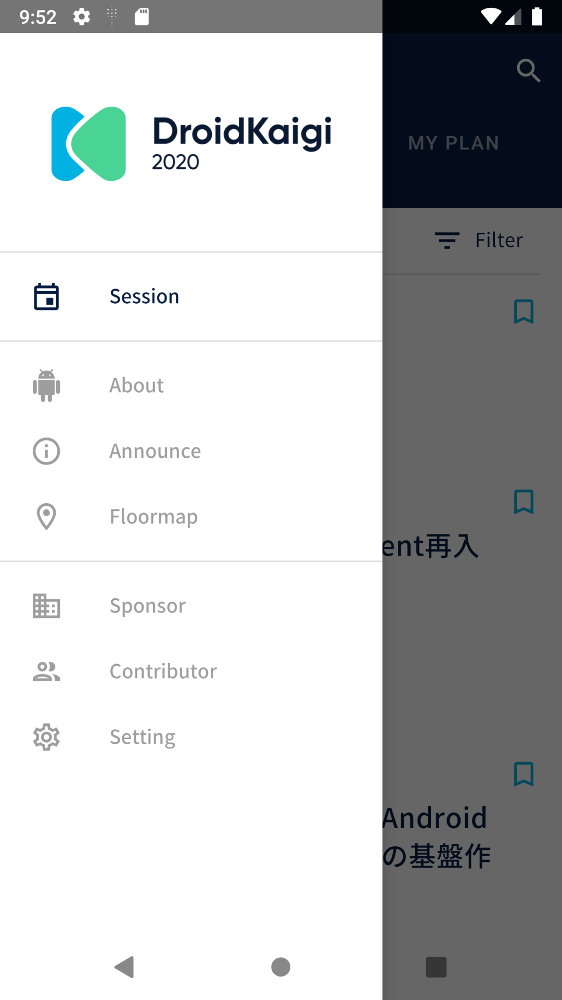

# DroidKaigi 2020 official Android app [](https://travis-ci.com/DroidKaigi/conference-app-2020)

We are currently working on the event. We are looking for contributors!

DroidKaigi 2020 is a conference tailored for developers on 20th and 21st February 2020.  

You can install the production app via Get it on Google Play.
// TODO: Add link to Google Play

And also, you can try the binary under development built on master branch through Try it on your device via DeployGate  

[](https://dply.me/qo28h3#install)

# Features

| top | drawer | |
|---|---|---|
|  |  | |

# Contributing

We always welcome any and all contributions! See [CONTRIBUTING.md](CONTRIBUTING.md) for more information  

For Japanese speakers, please see [CONTRIBUTING.ja.md](CONTRIBUTING.ja.md) 

## Requirements

Android Studio 3.6 and higher. You can download it from [this page](https://developer.android.com/studio/preview).

# Development Environment

## Multi module project
We separate the modules for each feature. We use the Dynamic feature modules for additional features.


## Kotlin Multiplatform Project

// TODO: Add MultiPlatform

# Architecture
This app uses an AndroidJetpack(AAC) based architecture using AAC(LiveData, ViewModel, Room), Kotlin, Kotlin Coroutines Flow, DataBinding, Dagger, Firebase.


It is designed to be a unidirectional data flow within the ViewModel.


## Fragment


Just observe() the `LiveData<UiModel>` of the ViewModel.

```kotlin
@Inject lateinit var sessionDetailViewModelFactory: SessionDetailViewModel.Factory
private val sessionDetailViewModel by assistedViewModels {
    sessionDetailViewModelFactory.create(navArgs.sessionId)
}

override fun onViewCreated(view: View, savedInstanceState: Bundle?) {
    super.onViewCreated(view, savedInstanceState)
    ...
    sessionDetailViewModel.uiModel
        .observe(viewLifecycleOwner) { uiModel: SessionDetailViewModel.UiModel ->
            ...
            progressTimeLatch.loading = uiModel.isLoading
            uiModel.session
                ?.let { session -> setupSessionViews(session) }
        }
    }
```

## ViewModel


The [LiveData Kotlin Coroutines builder](https://developer.android.com/topic/libraries/architecture/coroutines#livedata) runs when LiveData becomes active.   
And observe the data of the Coroutiens Flow of the repository.

The LiveData becomes LoadState.Loading before the Coroutiens Flow is executed by Flow.toLoadingState(), and becomes LoadState.Loaded when finished.

```kotlin
class SessionsViewModel @Inject constructor(
    val sessionRepository: SessionRepository
) : ViewModel() {

...
    private val sessionLoadState: LiveData<LoadState<SessionContents>> = liveData {
        emitSource(
            sessionRepository.sessionContents()
                .toLoadingState()
                .asLiveData()
        )
        sessionRepository.refresh()
    }
```


Construct UiModel LiveData from some such LiveData.  
The `combine` method works like RxJava's combineLatest.  
You can make the loading state of the screen from multiple LiveData states like `sessionLoadState.isLoading || favoriteState.isLoading`.

```kotlin
class SessionDetailViewModel @AssistedInject constructor(
    @Assisted private val sessionId: SessionId,
    private val sessionRepository: SessionRepository
) : ViewModel() {
...
    val uiModel: LiveData<UiModel> = combine(
        initialValue = UiModel.EMPTY,
        liveData1 = sessionLoadStateLiveData,
        liveData2 = favoriteLoadingStateLiveData
    ) { current: UiModel,
        sessionLoadState: LoadState<Session>,
        favoriteState: LoadingState ->
        // You can create loading state by multiple LiveData
        val isLoading = sessionLoadState.isLoading || favoriteState.isLoading
        UiModel(
            isLoading = isLoading,
            error = sessionLoadState
                .getErrorIfExists()
                .toAppError()
                ?: favoriteState
                    .getErrorIfExists()
                    .toAppError()
            ,
            session = sessionLoadState.value
        )
    }
```

Run Coroutines with `viewModelScope` when data changes, such as adding a session to Favorites.  
Because we do not want to end the process of adding a session to favorites with the back button, we use WorkManager to do the processing.  


```kotlin
class SessionDetailViewModel @AssistedInject constructor(
    @Assisted private val sessionId: SessionId,
    private val sessionRepository: SessionRepository
) : ViewModel() {
..
    private var favoriteLoadingStateLiveData: MutableLiveData<LoadingState> = MutableLiveData(LoadingState.Loaded)
...
    fun favorite(session: Session) {
        viewModelScope.launch {
            favoriteLoadingStateLiveData.value = LoadingState.Loading
            try {
                sessionRepository.toggleFavoriteWithWorker(session.id)
                favoriteLoadingStateLiveData.value = LoadingState.Loaded
            } catch (e: Exception) {
                favoriteLoadingStateLiveData.value = LoadingState.Error(e)
            }
        }
    }
```

## Design

* DroidKaigi 2020 Design Kit  
https://www.figma.com/file/RPPQQRys8IubNShKan8c2Z/DroidKaigi-2020-Design-Kit?node-id=0%3A2347  
* App  
https://www.figma.com/file/4r9becvhDy3GfXaXex8E8d/App  


## Thanks
Thank you for contributing!

* Contributors
  * [GitHub : Contributors](https://github.com/DroidKaigi/conference-app-2020/graphs/contributors)
* Designer  
  * [Chihokotaro / Chihoko Watanabe](https://twitter.com/chihokotaro)

## Credit
This project uses some modern Android libraries and source codes.

### Android

* [Android Jetpack](https://developer.android.com/jetpack/) (Google)
  * Foundation
    * AppCompat
    * Android KTX
    * Multidex
    * Test
  * Architecture
    * Data Binding
    * Lifecycles
    * LiveData
    * Navigation
  * UI
    * Emoji
    * Fragment
    * Transition
    * ConstraintLayout
    * RecyclerView
    * ...
* [Kotlin](https://kotlinlang.org/) (JetBrains)
  * Stdlib
  * Coroutines
  * Coroutines Flow
  * Serialization
* [Firebase](https://firebase.google.com/) (Google)
  * Authentication
  * Cloud Firestore
* [Dagger 2](https://google.github.io/dagger/)
  * Core (Google)
  * AndroidSupport (Google)
  * [AssistedInject](https://github.com/square/AssistedInject) (Square)
* [Material Components for Android](https://github.com/material-components/material-components-android) (Google)
* [Ktor](https://ktor.io/) (JetBrains)
  * Android Client
  * Json
* [OkHttp](http://square.github.io/okhttp/) (Square)
  * Client
  * LoggingInterceptor
* [Coil](https://github.com/coil-kt/coil) (Coil Contributors)
* [LeakCanary](https://github.com/square/leakcanary) (Square)
* [Stetho](http://facebook.github.io/stetho/) (Facebook)
* [Hyperion-Android](https://github.com/willowtreeapps/Hyperion-Android) (WillowTree)
* [Groupie](https://github.com/lisawray/groupie) (lisawray)
* [KLOCK](https://korlibs.soywiz.com/klock/) (soywiz)
* [MockK](http://mockk.io) (oleksiyp)
* [Injected ViewModel Provider](https://github.com/evant/injectedvmprovider) (evant)
* [Google I/O 2018](https://github.com/google/iosched) (Google)
* [TimetableLayout](https://github.com/MoyuruAizawa/TimetableLayout) (MoyuruAizawa)
* [Android Architecture Components samples](https://github.com/android/architecture-components-samples) (Google)
  * [AutoClearedValue](https://github.com/android/architecture-components-samples/blob/9826b59956eb93c9e627bdf16a19a1c8bc28ce14/GithubBrowserSample/app/src/main/java/com/android/example/github/util/AutoClearedValue.kt)

### iOS

// TODO: Add iOS Libraries
